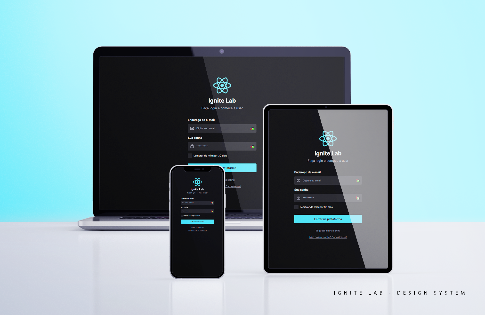

#### ⚠️ WORK IN PROGRESS ⚠️

### 🚀 Ignite Lab 3 - Design System: From Figma to React

##### This project was created alongside the teacher on a special series, with a few personal twists.

 

### 💻 Screenshots

 

### 🔎 Live View

- [🌐 Live Site Link](https://01-ignite-feed.vercel.app)
- [📚 Storybook Doc ](guilhermerera.github.io/ignite-design-system/)
- [✏️ Figma Design System](https://www.figma.com/file/isebwceKwRrt1ScuihEsLb/Ignite-lab-Design-System?node-id=0%3A1)

 

### 🎯 Project Goal

The goal was to learn how to work with Figma and how to create a design system on it. Also, how to get all that information set up with TailwindCSS in a React project, advanced techniques such as Component Composition, documenting and testing the UI with Storybook integrated with Jest, a little bit of Radix and more.

 

### ⚒️ Built With

   
   
